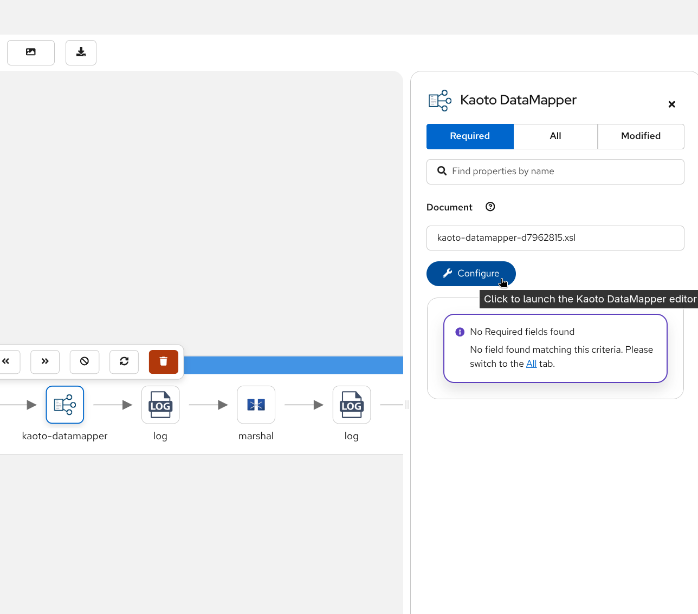

# Route 3: HL7→HL7 Transformation with Kaoto DataMapper

This route demonstrates hospital system integration using Kaoto DataMapper for visual HL7 data transformation.

## Scenario

**Multi-Hospital Patient Transfer System**: Transform patient admission messages from Hospital A format to Hospital B format while maintaining HL7 compliance.

## Files

- **route-transform.yaml** - Main route file with XSLT transformation step
- **input/adt-a01-hospital-a.hl7** - Sample HL7 message from Hospital A
- **kaoto-datamapper-placeholder.xsl** - Placeholder XSLT (to be replaced by Kaoto-generated XSL)
- **output/** - Generated transformed HL7 files

## Flow

```
File Consumer → Read HL7 ER7 (Hospital A) → Unmarshal (targetFormat=XML) → 
XSLT Transform (Kaoto DataMapper) → HL7 XML (Hospital B) → 
Marshal to ER7 → Save to output/ → Log Transformed ER7 (Hospital B)
```

## Prerequisites

- Camel JBang installed
- Java 17+
- Apache Camel 4.21.0-SNAPSHOT with PR #23741 merged
- VSCode with Kaoto extension installed
- HL7 v2.5 XML schemas in `schemas/` directory

## Data Transformation

This route transforms HL7 ADT^A01 messages from Hospital A format to Hospital B format.

### Key Transformations

1. **Facility Codes**: HOSP_A_ADT → HOSP_B_ADT, HOSPITAL_A → HOSPITAL_B
2. **Patient ID**: 12345^^^HOSP_A^MR → HB-12345^^^HOSP_B^MR
3. **Admission Type**: I → IP (code translation)
4. **Location**: WARD1^ROOM101^BED1^HOSP_A → W1^R101^B1^HOSP_B
5. **Provider Name**: SMITH^JANE^^^MD → SMITH^JANE^A^^MD
6. **Address**: MAIN ST/ANYTOWN → Main Street/Anytown (proper case)

### Input (Hospital A Format)
```
MSH|^~\&|HOSP_A_ADT|HOSPITAL_A|...|20260603120000||ADT^A01|MSG00001|P|2.5
PID|1||12345^^^HOSP_A^MR||DOE^JOHN^M||19800101|M|||123 MAIN ST^^ANYTOWN^CA^12345^USA||...
PV1|1|I|WARD1^ROOM101^BED1^HOSP_A||||SMITH^JANE^^^MD|||...
```

### Output (Hospital B Format)
```
MSH|^~\&|HOSP_B_ADT|HOSPITAL_B|...|20260603120000||ADT^A01|MSG00001|P|2.5
PID|1||HB-12345^^^HOSP_B^MR||DOE^JOHN^M||19800101|M|||123 Main Street^^Anytown^CA^12345^USA||...
PV1|1|IP|W1^R101^B1^HOSP_B||||SMITH^JANE^A^^MD|||...
```

## Configuring DataMapper

<!-- TODO: Screenshot - Opening the XSLT step in Kaoto and selecting "Configure DataMapper" -->


1. Open `route-transform.yaml` in VSCode
2. Kaoto extension will activate automatically
3. Click on the XSLT transform step
4. Select "Configure DataMapper"
5. Load source schema: `schemas/ADT_A01.xsd`
6. Load target schema: `schemas/ADT_A01.xsd` (same schema for HL7→HL7)
7. Create mappings:
   - **Direct mappings**: Patient name, DOB, gender (unchanged)
   - **Constant values**: Facility codes (HOSP_B_ADT, HOSPITAL_B)
   - **Transformations**: Patient ID prefix, admission type code, location abbreviation
8. Save the mapping (generates XSL file)

<!-- TODO: Screenshot - DataMapper UI with all Hospital A → B mappings completed -->


## Execution

```bash
cd 03.hl7-datamapper-transform
camel run route-transform.camel.yaml --camel-version=4.21.0-SNAPSHOT
```

**Important Notes**:
- The route will continuously process the input file until stopped (Ctrl+C)
- The placeholder XSL performs identity transformation (no changes)
- Replace `kaoto-datamapper-placeholder.xsl` with Kaoto-generated XSL for actual transformations
- Input HL7 file must use `\r` (carriage return) as segment separator

## Expected Output

The route will:
1. Read the HL7 ER7 message (Hospital A format)
2. Convert to HL7 XML format
3. Transform to Hospital B format using DataMapper XSL
4. Convert back to HL7 ER7 format (Hospital B)
5. Log all intermediate outputs

**Key Changes**:
- Facility codes: HOSP_A → HOSP_B
- Patient ID: 12345 → HB-12345
- Admission type: I → IP
- Location: WARD1^ROOM101 → W1^R101
- Provider: SMITH^JANE^^^MD → SMITH^JANE^A^^MD

## Key Benefits

- **Visual Mapping**: No code required for HL7 data transformation
- **HL7 Compliant**: Output is valid HL7 that can be marshaled to ER7
- **Maintainable**: Mappings are visual and self-documenting
- **Real-world**: Demonstrates hospital system integration pattern
- **Flexible**: Easy to add/modify mappings in Kaoto
- **Reusable**: Generated XSL can be used in any XSLT processor

## Real-World Applications

This pattern is common in:
- Hospital mergers and acquisitions
- Health Information Exchanges (HIE)
- EHR system migrations
- Multi-site healthcare networks
- Regulatory compliance transformations

## Screenshots

<!-- TODO: Screenshot - Route3 console output showing Hospital A input → XML → Hospital B XML → ER7 output -->

