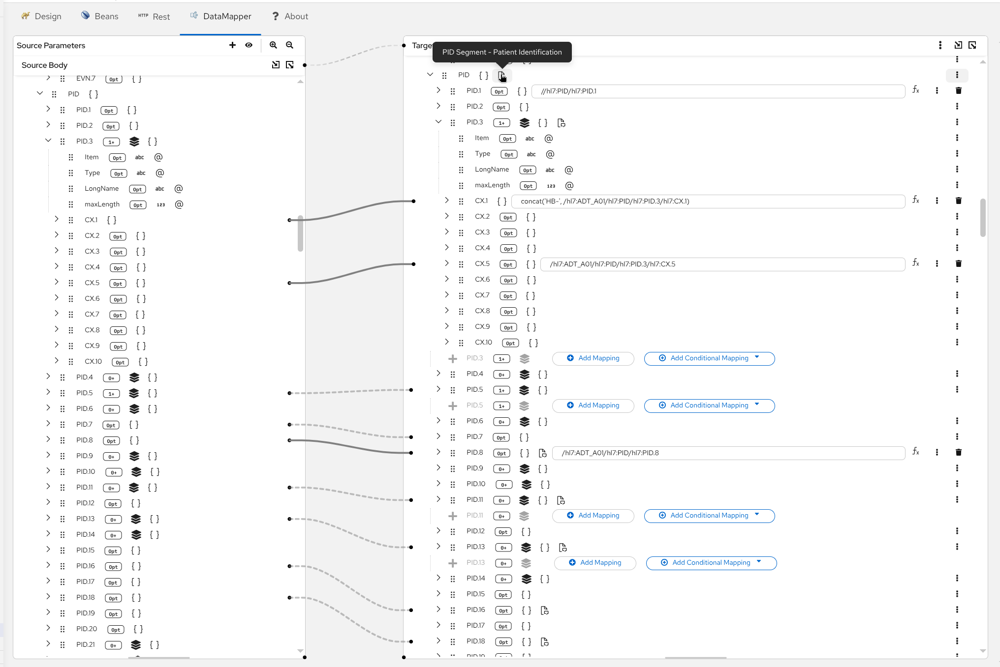

# HL7 ER7-XML Data Mapping PoC

This PoC demonstrates HL7 message transformation using Apache Camel's new `targetFormat=XML` feature (CAMEL-23669) combined with Kaoto DataMapper for visual data mapping.

## Overview

**Use Case**: Hospital A transfers a patient to Hospital B. The patient admission message (ADT^A01) needs to be transformed to match Hospital B's internal standards while maintaining HL7 compliance throughout the transformation.

**Key Features**:
- ✅ Direct ER7 ↔ XML conversion using new Camel 4.21.0 feature
- ✅ Visual data mapping with Kaoto DataMapper
- ✅ No manual HL7 parsing code required
- ✅ Bidirectional transformation support
- ✅ HL7 compliant throughout (enables marshal to ER7)

## Prerequisites

### Required Tools

1. **Camel JBang** (Latest version)

2. **Kaoto VSCode Extension**

4. **HL7 XML Schemas**
   
   **Required for Kaoto DataMapper**: Download official HL7 v2.5 XML Encoding schemas from HL7 International.
   
   **Steps to obtain schemas**:
   
   a. **Create free HL7 account** (required):
      - Visit https://www.hl7.org/
      - Click "Sign Up" or "Create Account"
      - Complete registration (free individual membership)
   
   b. **Download HL7 v2.5 XML schemas**:
      - Log in to your HL7 account
      - Navigate to: https://www.hl7.org/implement/standards/product_brief.cfm?product_id=144
      - Download "HL7 Version 2.5 XML Encoding Schema" package
      - Extract schemas to `03.hl7-datamapper-transform/schemas/` directory
   
   c. **Verify schemas**:
      ```bash
      # Check that schemas use correct namespace
      grep -r "urn:hl7-org:v2xml" 03.hl7-datamapper-transform/schemas/
      ```
   
   **Note**: This PoC uses HL7 v2.5 (see MSH-12 field in sample messages).

## Project Structure

```
camel-hl7-xml-poc/
├── 01.hl7-er7-to-xml/           # Route 1: Basic ER7 → XML conversion
├── 02.hl7-xml-to-er7/           # Route 2: Basic XML → ER7 conversion
├── 03.hl7-datamapper-transform/ # Route 3: HL7→HL7 transformation with DataMapper
│   └── schemas/                 # HL7 XML schemas (downloaded locally)
├── images/                      # Documentation screenshots
├── KAOTO_DATAMAPPER_SETUP.md    # DataMapper configuration guide
└── README.md                    # This file
```

## Routes

### Route 1: HL7 ER7 → XML Conversion

Demonstrates basic ER7 to XML conversion using the new `targetFormat=XML` feature.

**Flow**: `Timer → Read HL7 ER7 File → Unmarshal (targetFormat=XML) → Log XML Output`

**Execution**:
```bash
cd 01.hl7-er7-to-xml
camel run route-er7-to-xml.yaml adt-a01-input.hl7
```

**Key Feature**: The `targetFormat: XML` parameter enables direct conversion from HL7 ER7 to XML format without manual parsing.

[See Route 1 README for details](01.hl7-er7-to-xml/README.md)

---

### Route 2: HL7 XML → ER7 Conversion

Demonstrates XML to ER7 conversion (reverse direction).

**Flow**: `Timer → Read HL7 XML File → Marshal to ER7 → Log ER7 Output`

**Execution**:
```bash
cd 02.hl7-xml-to-er7
camel run route-xml-to-er7.camel.yaml adt-a01-input.xml
```

**Round-Trip Testing**: Use Route 1's XML output as input for Route 2 to verify data integrity.

[See Route 2 README for details](02.hl7-xml-to-er7/README.md)

---

### Route 3: HL7→HL7 Transformation with Kaoto DataMapper

Demonstrates hospital system integration with visual data mapping.

**Scenario**: Transform patient admission messages from Hospital A format to Hospital B format.

**Flow**: `Timer → Read HL7 ER7 (Hospital A) → Unmarshal (XML) → DataMapper → HL7 XML (Hospital B) → Marshal → ER7`

**Execution**:
```bash
cd 03.hl7-datamapper-transform
camel run route-transform.camel.yaml adt-a01-hospital-a.hl7 kaoto-datamapper-*.xsl
```

**Key Transformations**:
- Facility codes: HOSP_A_ADT → HOSP_B_ADT
- Patient ID: 12345 → HB-12345 (prefix + authority change)
- Admission type: I → IP (code translation)
- Location: WARD1^ROOM101^BED1 → W1^R101^B1
- Provider: SMITH^JANE^^^MD → SMITH^JANE^A^^MD
- Address: MAIN ST/ANYTOWN → Main Street/Anytown

[See Route 3 README for details](03.hl7-datamapper-transform/README.md)

## Kaoto DataMapper

<!-- TODO: Screenshot - DataMapper UI with completed Hospital A → B mappings -->


## Key Concepts

### targetFormat=XML

The new `targetFormat=XML` parameter (added in CAMEL-23669) enables direct conversion between HL7 ER7 and XML formats:

```yaml
unmarshal:
  hl7:
    targetFormat: XML  # Returns XML Document instead of HAPI Message
```

**Benefits**:
- No manual parsing code required
- Leverages HAPI's built-in XML support
- Works seamlessly with XSLT transformations
- Enables visual data mapping with Kaoto

### Visual Data Mapping

Kaoto DataMapper provides a visual interface for creating XSLT transformations:
- Drag-and-drop field mapping
- Built-in transformations (string concat, code translation, etc.)
- Auto-generates XSLT code
- No XSLT knowledge required

### HL7→HL7 Transformation

Route 3 demonstrates HL7→HL7 transformation (same schema, different data):
- Maintains HL7 compliance throughout
- Output can be marshaled to ER7 format
- Real-world hospital integration pattern
- Visual mapping with semantic transformations

## Sample Data

### Hospital A Format (Input)
```
MSH|^~\&|HOSP_A_ADT|HOSPITAL_A|RECEIVING_APP|RECEIVING_FACILITY|20260603120000||ADT^A01|MSG00001|P|2.5
EVN|A01|20260603120000
PID|1||12345^^^HOSP_A^MR||DOE^JOHN^M||19800101|M|||123 MAIN ST^^ANYTOWN^CA^12345^USA||(555)555-1234|||S||999-99-9999
PV1|1|I|WARD1^ROOM101^BED1^HOSP_A||||SMITH^JANE^^^MD|||MED||||1|||SMITH^JANE^^^MD|INS|12345678|||||||||||||||||||||||||20260603120000
```

### Hospital B Format (Output)
```
MSH|^~\&|HOSP_B_ADT|HOSPITAL_B|RECEIVING_APP|RECEIVING_FACILITY|20260603120000||ADT^A01|MSG00001|P|2.5
EVN|A01|20260603120000
PID|1||HB-12345^^^HOSP_B^MR||DOE^JOHN^M||19800101|M|||123 Main Street^^Anytown^CA^12345^USA||(555)555-1234|||S||999-99-9999
PV1|1|IP|W1^R101^B1^HOSP_B||||SMITH^JANE^A^^MD|||MED||||1|||SMITH^JANE^A^^MD|INS|12345678|||||||||||||||||||||||||20260603120000
```

## Real-World Applications

This pattern is common in:
- **Hospital Mergers**: Normalizing data between merged hospital systems
- **Health Information Exchanges (HIE)**: Standardizing data across multiple facilities
- **EHR Migrations**: Converting data formats during system transitions
- **Multi-Site Healthcare Networks**: Maintaining consistent data across locations
- **Regulatory Compliance**: Ensuring data meets specific format requirements

## Documentation

- **[KAOTO_DATAMAPPER_SETUP.md](KAOTO_DATAMAPPER_SETUP.md)** - Kaoto DataMapper configuration guide with schema setup

## References

- **HL7 International**: https://www.hl7.org
- **Apache Camel HL7 Component**: https://camel.apache.org/components/latest/hl7-dataformat.html
- **CAMEL-23669**: https://issues.apache.org/jira/browse/CAMEL-23669
- **HAPI HL7 Library**: https://hapifhir.github.io/hapi-hl7v2/
- **Kaoto**: https://kaoto.io/
- **Reference X12 PoC**: https://github.com/igarashitm/camel-x12-837-poc

## Important Note: Camel Version & PR Status

**This PoC uses Apache Camel 4.21.0-SNAPSHOT**

### Required Changes

1. **[CAMEL-23669](https://issues.apache.org/jira/browse/CAMEL-23669)**: Add `targetFormat=XML` option to `camel-hl7`

### Current Status

**This PoC assumes PR #23741 is merged** and demonstrates the complete functionality. All routes are written correctly and will work once the PR is merged.

### Execution Commands

All routes require `--dep` to add the HAPI HL7 v2.5 structure library (it's an optional dependency of `camel-hl7`):

```bash
# Route 1: ER7 → XML
cd 01.hl7-er7-to-xml
camel run route-er7-to-xml.camel.yaml --dep=mvn:ca.uhn.hapi:hapi-structures-v25:2.6.0

# Route 2: XML → ER7
cd 02.hl7-xml-to-er7
camel run route-xml-to-er7.camel.yaml --dep=mvn:ca.uhn.hapi:hapi-structures-v25:2.6.0

# Route 3: Hospital A → Hospital B transformation
cd 03.hl7-datamapper-transform
camel run route-transform.camel.yaml --dep=mvn:ca.uhn.hapi:hapi-structures-v25:2.6.0
```

### When Camel 4.21.0 is Released

Once Camel 4.21.0 is officially released, you can:
1. Run with: `camel run route.yaml` (without `--camel-version` flag)

To check for Camel releases, visit: https://camel.apache.org/download/

---

## License

This PoC is provided as-is for demonstration purposes.
